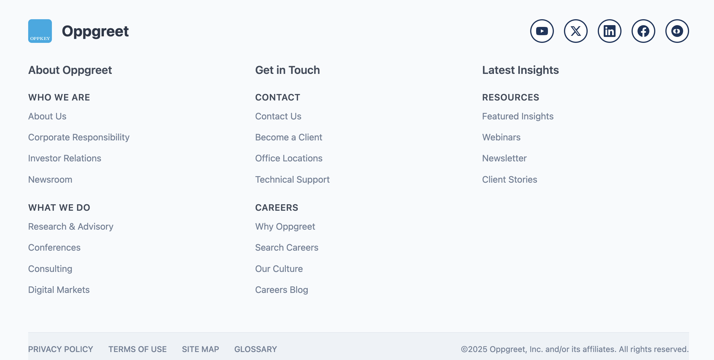

# Quarto Design Test

[Live Site](https://codetricity.github.io/oppkey-quarto/)

## front page

## Oppkey White Papers

## footer

## blog index

## This is a test of using Quarto with its built-in Bootstrap 5 template.

## Main design decision

Take multiple screenshots of an example website that has the key design elements that you want. Here, we used gartner.com 

Note that it has the same key elements of this Oppgreet site:

* Header - with includes Logo | Nav bar main menu | "Become a client" button
* Main image with overlayed CTA box and "Learn How" button
* Cards in grid with main images for key documents
* Latest Insights section goes to blog page
* Footer - which includes social media accounts icons | links to main sections

## Why Use Quarto?

Quarto has distinct advantages for our clients who need:

- **Technical blogs, docs & dashboards** where code, data, and prose must stay in sync.  
- **Teams already using Git/GitHub** for source control and collaboration.  
- **Sites that must be rock-solid under traffic spikes** (no PHP processes to exhaust).  
- **Budgets that favor free static hosting** over managed WordPress plans.

[Read more](why-quarto.md)

## Design Strategy for Oppkey Quarto

* Custom styling is in `template-assets/css`.
* HTML snippets are in `_includes`
* Used AI to adjust the styling with web site image input
* `:::` in Quarto is a `
` in HTML
  `::: {.card .card-with-image}` applies the styling from `custom.css`

## Note on css files

* The css files are stored in `template-assets/css` by convention.
* The `custom.css` file is the default css design file.
* Other css files are additive.
* Other files can be stored in `template-assets/css`. Currently, `midori-page.css` controls how the `midori.qmd` file looks. `blog.css` controls how the main blog page is styled.
* Include `css:` in the header to connect to the separate css file. Example: `css: /template-assets/css/blog.css`
